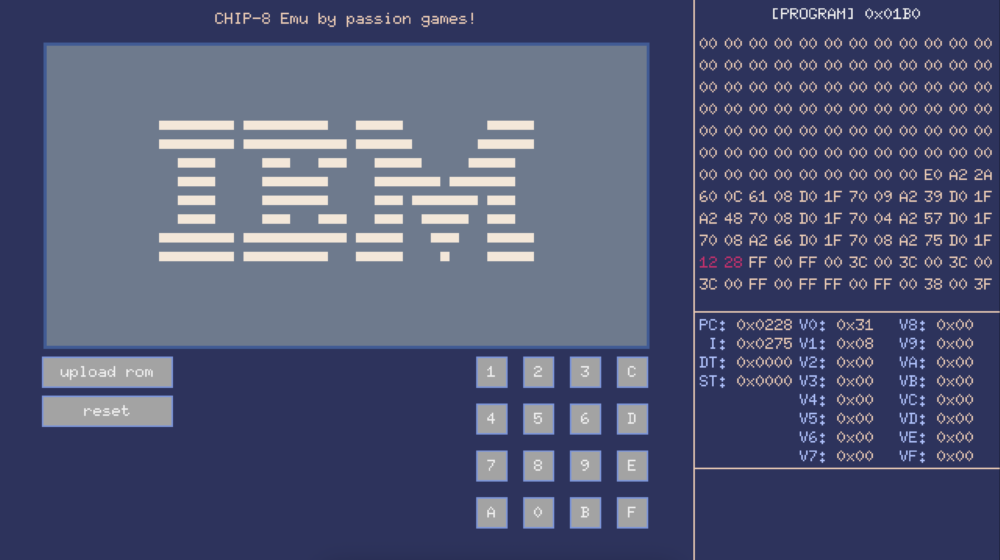

# CHIP-8 Emu by passion games team

CHIP-8 is an interpreted programming language, developed by Joseph Weisbecker on his 1802 microprocessor. It was initially used on the COSMAC VIP and Telmac 1800, which were 8-bit microcomputers made in the mid-1970s. CHIP-8 was designed to be easy to program for and to use less memory than other programming languages like BASIC. Interpreters have been made for many devices, such as home computers, microcomputers, graphing calculators, mobile phones, and video game consoles. (C) Wikipedia

## Live demo

## Where to get games/roms?
You can download them all over the Internet. For example: https://github.com/kripod/chip8-roms
